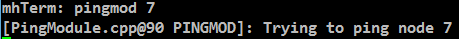
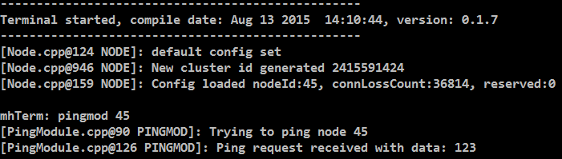

<<_index.adoc#,Home>>

== Implementing a Custom Module

This tutorial should guide anyone through the process of creating a new
FruityMesh module. We'll implement a PingModule that allows us to ping a
node and get its response. You'd normally implement ping functionality
into the StatusReporter oder DebugModule, which is where it belongs, but
the use-case acts as a good and easy example for building your own
module. You can find the finished files in the folder `src/examples` or
you can just follow the tutorial.

=== What is a Module

Modules are used to structure functionality that does not directly
interfer with the mesh-logic. Modules extend the `Module` class. Each
module has the possibility to save a *persistent configuration*. It can
be loaded or unloaded and it is possible to decide which modules are
part of the firmware during compile time. A module can choose to
register an *UART listener* and react on commands, it can also *output
to UART* for logging or communication purposes. It can also *send data
packets* through the mesh and *receive data*.

Here is an overview over some of the handlers that it can use:

* *ConfigurationLoadedHandler*: Is called when a new Module
configuration is loaded
* *TimerEventHandler*: Is called at a fixed interval to do periodic
tasks
* *BleEventHandler*: Routes all Bluetooth Low Energy events to the
module
* *MeshMessageReceivedEventHandler*: Delivers data that has been sent
over the mesh
* *TerminalCommandHandler*: Gets called when data is received over UART

=== Creating a Ping module

I will now guide you through the steps to implement a simple module that
can ping another node over the network and parse the response.

==== Step 1

First, clone the `TemplateModule.cpp` file from the `src/examples`
folder into `src/modules/PingModule.cpp`, afterwards, do the same with
`TemplateModule.h` but put it in the `inc/` folder. You must of course
refactor the Method names and some more variales, just use the search
function and look out for the string "template" anywhere in those two
files and rename them accordingly.

==== Step 2

Activate your module by instantiating it in the constructor of
`src/FruityMesh.cpp` right where all the other modules are instantiated.
You might have to increase the MAX_MODULE_COUNT in `config/Config.h`.
Your PingModule Constructor needs a moduleID for instantiation. All
module Ids are specified in the Config.h (enum moduleID) as well. You
should add a new enum entry under the section "Custom modules", e.g.
`PING_MODULE_ID=200`.

For example initialization can look like this:

[source,C++]
----
activeModules[15] = new PingModule();
----

You should also include the new `<PingModule.h>`.

Once the modules .cpp file is in the modules folder, it will
automatically be included in the compilation.

==== Step 3

Now go ahead and try to compile the binary and flash it to a device.
Connect via terminal and input *get_modules this*. You should now see a
list of modules and your new Ping modules id should be part of it.

It does not do much yet, but we'll now start to add more functionality.

==== Step 4

Your PingModule does already overwrite a few of the methods in its
base-class. One of these is the TerminalCommandHandler. We'll keep it
simple for this tutorial and we'll only implement the ping command so
that it can be triggered via a locally connected terminal. (It would
also be possible to trigger a remote node to send a ping and communicate
the result back to another node).

In the TerminalCommandHandler, add the following lines to the beginning
of the function:

[source,C++]
----
if(TERMARGS(0, "pingmod")){
    //Get the id of the target node
    nodeID targetNodeId = atoi(commandArgs[0]);
    logt("PINGMOD", "Trying to ping node %u", targetNodeId);
    
    //TODO: Send ping packet to that node
    
    return true;
}
----

The command name and command arguments should be in lowercase letters to
be consistent with other commands. You must include `<stdlib.h>` so that
the atoi method works.

Next, flash it to your device again and watch if it reacts on your
pingmod command. If it does not, make sure you are using the logtag
"PINGMOD" and you either enable it by writing *debug pingmod* in the
terminal first, or you enable the logtag by default in FruityMesh.cpp.

==== Step 5

Now that the module is reacting to our command, we want to send our ping
packet. Because this is going to be a very simple message, we will use a
predefined message format called `connPacketModule`. This packet is
intended to be used for triggering actions and for responding to these
triggers. It has a special message header that contains the moduleId and
an actionType. This will ensure that they do not interfere with mesh
messages or messages from other modules.

To keep our module messages organized, we'll add an enum that contains
all of our messages in the `private:` section of our `PingModule.h`
file:

[source,C++]
----
enum PingModuleTriggerActionMessages{
    TRIGGER_PING=0
};
----

Next, we add the code that is responsible for sending this packet to the
other node. The previously written code now looks like this:

[source,C++]
----
if(TERMARGS(0, "pingmod")){
    //Get the id of the target node
    nodeID targetNodeId = atoi(commandArgs[0]);
    logt("PINGMOD", "Trying to ping node %u", targetNodeId);

    //Some data
    u8 data[1];
    data[0] = 123;

    //Send ping packet to that node
    SendModuleActionMessage(
            MESSAGE_TYPE_MODULE_TRIGGER_ACTION,
            targetNodeId,
            PingModuleTriggerActionMessages::TRIGGER_PING,
            0,
            data,
            1,
            false
    );

    return true;
}
----

This code creates a buffer of 1 byte and fills in some data (123). This
data is not necessary for a ping and was only added for illustration
purpose. The message is sent as a ModuleMessage with the moduleId
automatically added by the `SendModuleActionMessage` method. The
actionType is TRIGGER_PING. The message type
`MESSAGE_TYPE_MODULE_TRIGGER_ACTION``is used for sending messages that
await a response.

The ConnectionManager (cm) will handle the transmission of this packet,
it will copy the packet to its buffer and queue the packet transmission.
It is important to pass the size of payload (1). The last parameter is
used to specify that this packet should be transmitted by using
BLE-unacknowledged packet transmission (WRITE_CMD).

==== Step 6

Next, we want to see if the packet arrived at its destination, we'll
need to implement the MeshMessageReceivedEventHandler in our PingModule
which looks like this:

[source,C++]
----
void PingModule::MeshMessageReceivedHandler(BaseConnection* connection, BaseConnectionSendData* sendData, connPacketHeader* packetHeader)
{
    //Must call superclass for handling
    Module::MeshMessageReceivedHandler(connection, sendData, packetHeader);

    //Filter trigger_action messages
    if(packetHeader->messageType == MESSAGE_TYPE_MODULE_TRIGGER_ACTION){
        connPacketModule* packet = (connPacketModule*)packetHeader;

        //Check if our module is meant and we should trigger an action
        if(packet->moduleId == moduleId){
            //It's a ping message
            if(packet->actionType == PingModuleTriggerActionMessages::TRIGGER_PING){

                //Inform the user
                logt("PINGMOD", "Ping request received with data: %d", packet->data[0]);

                //TODO: Send ping response
            }
        }
    }
}
----

In the `PingModule.h`, you must now also add the definition for this
handler or uncomment it.

We can now perform a simple test by flashing this new firmware on our
development board again. There is a simple trick that allows us to test
the functionality with a single node by pinging the node itself:

The ConnectionManager will parse the packet and will route it back to
the MeshMessageReceived without broadcasting it because the nodeId is
the same as its own. As you can see, the packet triggered the
appropriate action in the node.

==== Step 7

With this working, you should now perform a test with two different
nodes. Flash both of them, connect with two terminals and watch how the
packet is delivered:

image:img/tutorial-pingmod3.png[pingmod_3]

==== Step 8

Now, a proper ping message should, well, .... pong. That's why we need a
return packet. Go to `PingModule.h` and add another enum that contains
action responses:

[source,C++]
----
enum PingModuleActionResponseMessages{
    PING_RESPONSE=0
};
----

Then, go back to your .cpp file and insert this updated code:

[source,C++]
----
void PingModule::MeshMessageReceivedHandler(BaseConnection* connection, BaseConnectionSendData* sendData, connPacketHeader* packetHeader)
{
    //Must call superclass for handling
    Module::MeshMessageReceivedHandler(connection, sendData, packetHeader);

    //Filter trigger_action messages
    if(packetHeader->messageType == MESSAGE_TYPE_MODULE_TRIGGER_ACTION){
        connPacketModule* packet = (connPacketModule*)packetHeader;

        //Check if our module is meant and we should trigger an action
        if(packet->moduleId == moduleId){
            //It's a ping message
            if(packet->actionType == PingModuleTriggerActionMessages::TRIGGER_PING){

                //Inform the user
                logt("PINGMOD", "Ping request received with data: %d", packet->data[0]);
                
                u8 data[2];
                data[0] = packet->data[0];
                data[1] = 111;
                
                //Send ping packet to that node
                SendModuleActionMessage(
                        MESSAGE_TYPE_MODULE_ACTION_RESPONSE,
                        packetHeader->sender,
                        PingModuleActionResponseMessages::PING_RESPONSE,
                        0,
                        data,
                        2,
                        false
                );
            }
        }
    }

    //Parse Module action_response messages
    if(packetHeader->messageType == MESSAGE_TYPE_MODULE_ACTION_RESPONSE){

        connPacketModule* packet = (connPacketModule*)packetHeader;

        //Check if our module is meant and we should trigger an action
        if(packet->moduleId == moduleId)
        {
            //Somebody reported its connections back
            if(packet->actionType == PingModuleActionResponseMessages::PING_RESPONSE){
                logt("PINGMOD", "Ping came back from %u with data %d, %d", packet->header.sender, packet->data[0], packet->data[1]);
            }
        }
    }
}
----

This code sends a response to the ping request, includes the data that
came with the initial request and adds some more data. Also, it adds
another condition that checks for the reply to the ping request and
prints it out on the terminal.

==== Step 9

That's it, you should now be able to ping any node in the mesh network
and see its response. The intermediate nodes will automatically route
all traffic without having to know what kind of message it is.

image:img/tutorial-pingmod4.png[pingmod_4]

You would probably want to use a counter with the ping message to
generate a handle for a ping. Then, you'd be able to calculate the time
that it took for the packet to come back through the mesh. And as I've
said initially, you would not necessarily want to create new module for
pinging other nodes but you'd have that functionality in a core module.

I hope you've been successful by following this tutorial and I'll wait
for the modules you're going to implement on top of FruityMesh :-)
