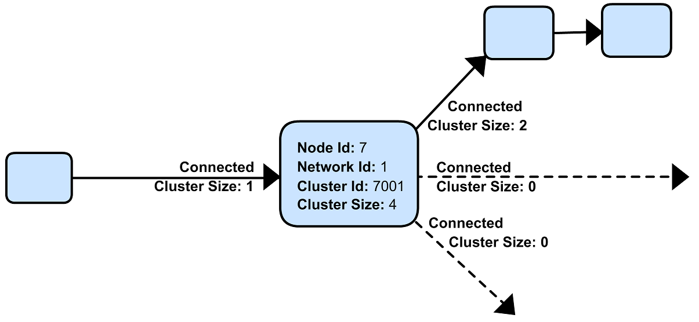

ifndef::imagesdir[:imagesdir: ../assets/images]
= FruityMesh Algorithm

== Intro
A mesh should be able to build and
manage all connections without user interaction. There is one big
restriction when it comes to BLE connections. Having more than one
connection as a Peripheral can degrade mesh performance and lead to
connection losses. Using one connection as a Peripheral and up to three
connections as a Central has proven a good configuration for mesh
connections. With these settings, the following will lead to problems
where two nodes cannot connect to each other because their one
connection as a Peripheral is already taken.

image:img/mesh-overview.png[impossible]

There is no way to know the size - or the participating nodes - of our
mesh in advance. Distributing the presence of a node over long distances
would be a bad idea because of the time it takes and the energy it
costs. This means that every node can only see its surroundig nodes.

== Simulator
There is a <<Simulator.adoc##,Simulator>> available that
will show you how the algorithm works. It allows you to play around with
different configurations and see how the mesh reacts.

== Node
Each node saves a few variables like network id, cluster id,
cluster size and its own id. Additionally it keeps some information for
each of its connections.  During
discovery, it broadcasts its nodeId, clusterSize and clusterId along
with a few other measures in special advertising packets (<<Specification.adoc##,JOIN_ME>>
packets). It will also scan for some time to receive
discovery packets of surrounding nodes. From these packets, it selects
the best connection partner and connects to him.

== Clustering
Now, the real trick here is the clustering. Because every
node knows the size of the cluster that it's part of, it uses this as a
criteria when connecting to others. Big clusters can always decide to
which nodes they want to connect and smaller clusters will have to obey.
Any change in cluster size due to connection or disconnection is
broadcasted through the exisiting connections.
image:img/clustering.png[cluster forming] After a few <<Specification.adoc##,JOIN_ME>> packets
have been collected, these are processed in the ClusterScore function to
determine the best connection partner. A node will never try to connect
to a node with the same clusterId which does effectively prevent loops.

== Handshake
After receiving the <<Specification.adoc##,JOIN_ME>> packets, some time has passed
and the other node might already be in another cluster or in a different
state than before. This is why the two nodes will first do a handshake
after connecting where they pass each other the latest information. Only
one Handshake must happen at a time to prevent race conditions. Once
they are satisfied with their partner, the connection can be used,
otherwise it will be disconnected.

== States
The algorithm uses a state machine that switches between
different DISCOVERY and HANDSHAKE states. This helps the node to reduce
its energy usage.

== Self-Healing
Once a connection in the cluster breaks up, the smaller
cluster distributes a new cluster id among its nodes. This will
ultimately repair the missing connection through a similar way.
image:img/self-healing.png[self healing]

After each connection loss, a node will increment its
connection-loss-counter. This counter is used together with the nodeId
to generate a clusterID, this is necessary because there might be cases
where the founding node of a cluster can not join the cluster anymore if
it generates the same clusterID again.

== Connection
Master Bit Because a node cannot know for certain at any
time if it is part of the bigger cluster, there might be times where two
connected nodes both think they are part of the bigger cluster, which
would pose a threat to our mesh once the connection drops. Therefore,
each connection is assigned a masterBit that is passed to the node that
is part of the bigger cluster. Now, it is only possible that the
masterBit is in transition during a disconnect and both cluster must
dissolve, but they cannot form islands anymore.

== More
Anybody interested in a much more detailed explanation of the
Algorithm is welcome to take a look at
<<The-Algorithm-in-Detail.adoc#,The Algorithm in Detail>> page.
